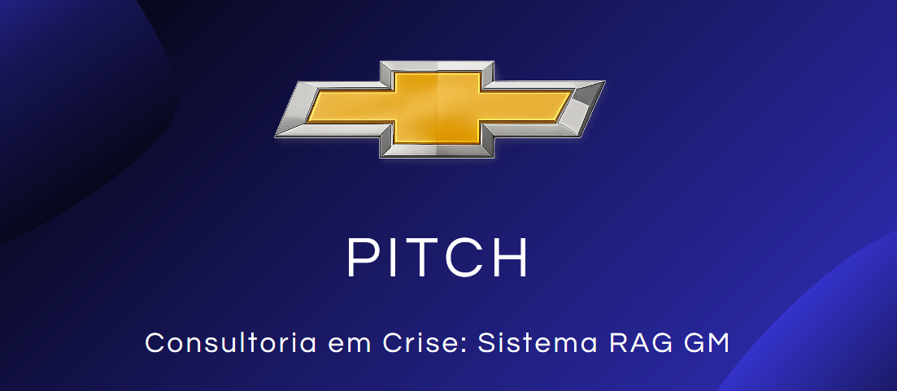
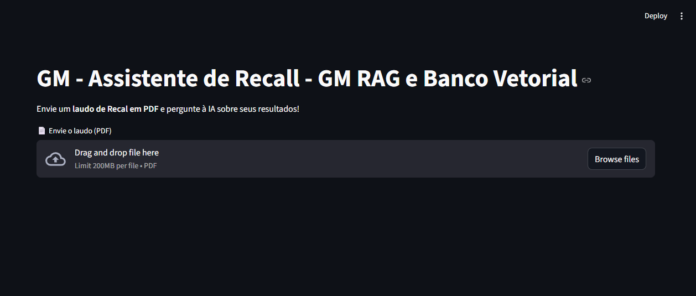

<center>



</center>

# Apresentação do problema

**"Consultoria em Crise: Construindo um Protótipo RAG para Salvar o Dia"**


A atividade final da disciplina consiste na aplicação prática dos conceitos de RAG (Retrieval-Augmented Generation), por meio da construção de um chatbot voltado à análise de documentos de recall da empresa fictícia GN Motors. Para tanto, foi desenvolvido um MVP (Minimum Viable Product), capaz de realizar consultas em um banco vetorial.

Um banco de dados vetorial armazena e consulta representações numéricas de dados não estruturados, como texto, imagens e áudio, chamadas embeddings vetoriais. Em vez de buscar por palavras-chave, ele realiza busca de similaridade semântica, encontrando dados conceitualmente semelhantes. Isso é crucial para aplicações como mecanismos de busca avançados, recomendação de produtos e a operação de modelos de linguagem grande (LLMs), onde a proximidade entre vetores indica que seus dados de origem são semanticamente relacionados. 


### Equipe:
- Davi
- Lincon 
- Luana 
- José Edson 
- Francisco
- Wandeilson 


### Tecnologias empregadas


### Requisitos do Sistema

- Python >= 3.13

#### Criando o ambiente virtual - Windows: 
```
python -m venv venv
.\venv\Scripts\activate
```

#### Instalando as dependências 
```
pip install -r requirements.txt
```

#### Copiando o repositório 

Clone ou baixe o projeto  

#### Executando o projeto 
```
streamlit run app.py
```
#### Demonstração 
Acesse a aplicação atraves dos links: 
> Local URL: http://localhost:8501

> Network URL: http://192.168.0.4:8501


#### Projeto em execução
<center>



</center>
